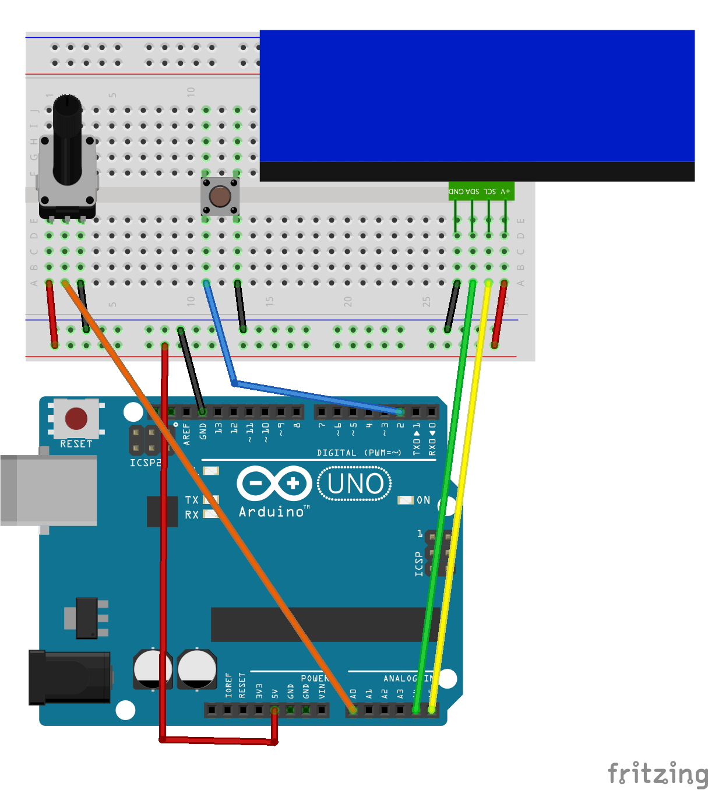

# i2cLCD

Arduino sketches controlling LCD with I2C communication.
Header files named `i2cLCD.h` are same in the directories.
All sketches in this project use [following LCD](http://akizukidenshi.com/catalog/g/gK-08896/).

I2C通信を使って液晶ディスプレイを制御するArduinoスケッチ集．
ヘッダファイル`i2cLCD.h`は全てのスケッチで同じものを使っています．
このプロジェクトで使用しているLCDは[こちらの秋月のもの](http://akizukidenshi.com/catalog/g/gK-08896/)です．

The sketches work with the following circuit.

スケッチは下の図の回路で動作します．

## i2cLCDintro

Primary sample to use an I2C LCD.

LCDの接続を確認するプログラム．

## i2cLCDanalog

Show a raw value and aan verage value read from Analog Pin in the LCD.

Analogピンから読み取ったデータをディスプレイに表示します．

## i2cLCDgame

Game avoiding obstacles with the tactile switch.

LCD で障害物を回避するゲームを実行します．
